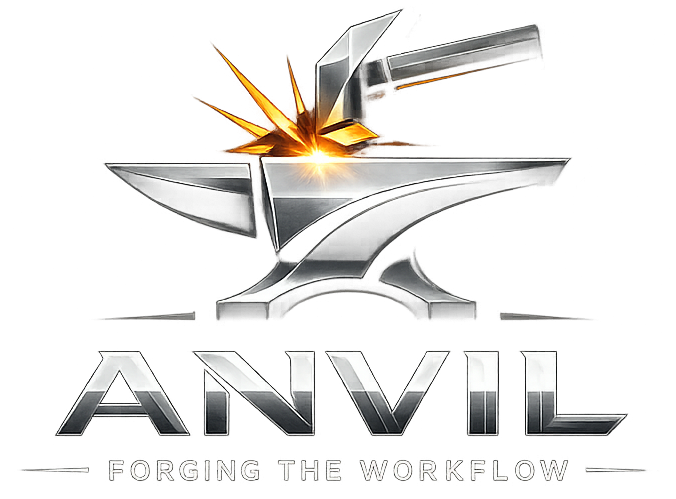

# Anvil



**Forge the Workflow.**
*Structure for vibe coding.*

Anvil is a single, self-contained AI coding agent for the terminal. The coder is a
**real agent** — it reads, writes, edits, and runs your project itself (like Claude
Code, Cursor, or Aider) — but Anvil wraps it in a **disciplined two-gate review
workflow** so a long vibe-coding session can't quietly drift off the rails.

What makes Anvil different isn't the coder — everyone has one of those now. It's the
**workflow**: at two human gates, two *different model families* review the work —
once on the plan, once on each phase's `git diff` — in a sequential
**review → fix → re-review** loop. You approve; the coder does the work; a genuine
cross-vendor second opinion keeps it honest.

One Rust binary. Model-agnostic. Installs in one line and updates itself.

> **Status: Public Beta.** Anvil is feature-complete for its core workflow and installs/updates
> cleanly — but it's early. It's been field-tested mostly on **Windows** (macOS/Linux build in CI
> but haven't been run in anger yet); several big pieces landed recently; and the review-gate flow
> is verified by hand rather than an automated suite. Expect rough edges, and please
> [file issues](https://github.com/ai-nhancement/Anvil/issues) — that feedback is exactly what the
> beta is for. For the best experience, use a capable **tool-calling** model for the coder role.

---

## Highlights

- 🔨 **Two human gates, cross-vendor review** — the plan and each build phase are critiqued by two *different* model families. Exactly two reviews per gate; no R3+, no drift.
- 🔁 **Sequential review loop** — R1 reviews → the coder applies fixes → you review → R2 reviews → the coder applies fixes → summary → you approve. R2 deliberately re-reviews *after* R1's fixes, catching bugs those fixes introduce.
- 🤖 **A real agent coder** — reads, edits, and runs the repo through tools (including a reliable `apply_patch` diff format). No attaching files, no copy-pasting output to disk.
- 🧠 **Doesn't lose the plot** — a persistent task anchor, automatic compaction into working memory, and a lightweight repo map keep the coder on-goal across long, tool-heavy sessions.
- 🌐 **Any provider** — Ollama / local, OpenAI, xAI (Grok), Anthropic, Groq, Azure, AWS Bedrock, Google, OpenRouter, and any OpenAI-compatible gateway. Mix vendors freely — that's the whole point.
- 🧩 **One config for every repo** — set up providers, models, and roles once (globally); override per-repo only when you want to.
- 📦 **One-line install + self-update** — prebuilt binaries for macOS, Linux, and Windows; `anvil update` swaps the binary in place.
- 🖥️ **A forge-themed TUI** — live streaming and tool activity, a selectable command-approval prompt, and break-in-anytime interrupt.

---

## Install

One line, no Rust toolchain required — it downloads a prebuilt binary for your OS and puts it on your `PATH`:

```sh
# macOS / Linux
curl -fsSL https://raw.githubusercontent.com/ai-nhancement/Anvil/master/install.sh | sh
```

```powershell
# Windows (PowerShell)
irm https://raw.githubusercontent.com/ai-nhancement/Anvil/master/install.ps1 | iex
```

<details>
<summary>Other ways to install</summary>

```sh
# Pin a specific version
ANVIL_VERSION=v0.2.0 curl -fsSL https://raw.githubusercontent.com/ai-nhancement/Anvil/master/install.sh | sh

# From source (requires the Rust toolchain)
cargo install --path .
# or: cargo build --release   (binary at target/release/anvil)
```

Prebuilt binaries for every release live on the [Releases page](https://github.com/ai-nhancement/Anvil/releases).
Targets: macOS (Intel + Apple Silicon), Linux (x86_64 + arm64, static musl), Windows (x86_64).
</details>

## Updating

Anvil keeps itself current. On launch it does a quiet, cached (once/day) check for a
newer release; when one exists, the header shows a pulsing
**`⬆ UPDATE vX.Y.Z — /update to apply`**. To update:

```sh
anvil update     # from the shell, or
/update          # from inside the TUI
```

Either one downloads the right prebuilt binary for your platform and replaces the
running one in place — no reinstall, no toolchain. Restart Anvil to use the new
version. (Set `ANVIL_NO_UPDATE_CHECK=1` to silence the boot check.)

## Quick Start

```sh
# In any repo: create Anvil's per-project state dir
anvil init

# Launch the full TUI (auto-starts the setup wizard on first use)
anvil
```

First run opens a fast setup wizard:

- **Quick local Ollama** (`Ctrl+S`, if Ollama is reachable on `:11434`) — pick live models for CODER / R1 / R2.
- Or **add a provider** (OpenAI, xAI, Anthropic, Groq, custom, …) with a live model list and role assignment.

Setup is saved to a **global config** (see [One config for every repo](#one-config-for-every-repo)), so you only do it once — every future repo is configured the moment you `cd` in.

Then just type to chat with your coder. It works directly in the project directory — nothing to attach or include.

> **Tool-calling matters.** The coder drives itself through tool calls, so it needs a model that supports tool/function calling. Frontier hosted models (Claude, GPT, Grok, Gemini) all do; many small local models don't. Anvil reads each model's capabilities from [models.dev](https://models.dev) and **warns you at startup** if your coder model can't do tool calls.

---

## The Workflow

Free-form agentic chat by default; structure only at the two gates. The forge runs hot
through a full heat: the coder is **smithing** (thinking) and **forging** (running a
tool), older context gets **clinkered** (compacted) out, the reviewers **temper** the
work, and you **quench** it to lock it in.

### Plan gate

1. Talk with the coder about goals, constraints, and architecture.
2. Ask it to write the plan — it creates `plan.md` itself (phases `## P0 — Name`, each with a goal, 3–8 actions, a deliverable, and 2–5 acceptance criteria).
3. **`/lock-plan`** kicks off the sequential review loop:
   - **R1** (reviewer-a) critiques `plan.md` → the coder applies the fixes → **⏸ pause** (you review) → **`/continue`**
   - **R2** (reviewer-b, a different model family) critiques the revised plan → the coder applies fixes → **⏸ pause** → **`/continue`**
   - the coder **summarizes** both rounds for you
4. **`/accept-plan`** — *quench* the plan: record its hash and unlock phase work. Findings are saved to `REVIEW_plan_R1.md` / `REVIEW_plan_R2.md` at the repo root.

### Phase gate (repeat per phase)

1. **`/phase-start P0`** (optional — you can just tell the coder to start a phase).
2. The coder implements the phase directly: reads what it needs, edits files, runs tests. You approve each shell command (see [Approving commands](#approving-commands)).
3. **`/accept-phase`** runs the *same* R1 → fix → ⏸ → R2 → fix → ⏸ → summary loop, but on the actual `git diff`.
4. **`/ship-phase`** — *quench* the phase. (Re-run `/accept-phase` any time to re-review.)

**The invariant:** the human approves at each gate; the coder does the creative work and the file changes; two diverse reviewers supply a critical second opinion on the locked artifact (the plan, then each phase's diff). Because **R2 reviews after R1's fixes have been applied**, it catches problems the first round's fixes introduced — the part single-pass review misses.

---

## The Coder (agent core)

Between the gates it's an ordinary, capable coding agent — built to stay on task and not flail:

- **Real tools, scoped to the repo root** (paths that escape the root are rejected):
  `read_file`, `write_file`, **`apply_patch`** (a context-located, multi-file diff format — validated before any write, far more reliable than blind string replace), `edit_file` (exact-match replace, for trivial edits), `list_dir`, `grep`, `run_command`, `project_state`.
- **Task anchor** — the original objective is pinned into every turn, so even a long, compacted session (or a bare `continue`) never loses the goal.
- **Auto-compaction ("clinkering")** — when the conversation outgrows the model's context budget, older turns are summarized into working memory (re-injected every turn) instead of silently dropped. No manual `/compact` needed (but `/clinker` is there if you want it).
- **Lightweight repo map** — a ranked, budgeted map of the project's top-level symbols is injected each turn, so the coder knows where things live instead of grepping blindly.
- **Per-model context budgeting** — Anvil reads each model's real context window from models.dev and sizes the working window to it: small local models get a small window (no overflow), large models get a large one.
- **Loop breaker** — repeated identical reads are short-circuited, so a weaker model can't spin into the step cap.
- **Resilience** — transient provider hiccups (timeouts, 5xx, rate limits) are retried with backoff instead of killing the turn; a failed request is captured to `.anvil/last-llm-error.json` for diagnosis.
- **Grounding every turn** — a live reality snapshot (workflow stage, current phase, plan slice, git status), plus user-editable context files: `decisions.md` (durable preferences + verification commands), `assumptions.md` (unverified hypotheses), `scratch.md` (disposable), and `ARCHITECTURE.md`.
- **Durable memory** — the full conversation is an append-only ledger (`.anvil/session.json`); it survives restarts.

---

## One config for every repo

Provider/model/role setup lives in a **global config** shared by every repo, so you
never set it up twice:

```
load order:   <OS config dir>/anvil/anvil.toml     ← global base (set up once)
              <repo>/anvil.toml                     ← optional per-repo override
```

- **Global** (e.g. `%APPDATA%\anvil\anvil.toml` on Windows, `~/.config/anvil/anvil.toml` on Linux/macOS) holds providers, model bindings, and roles. Set up once via `Ctrl+S` / `/config` / `anvil setup`.
- A repo's own `anvil.toml`, **if present**, overlays the global one — providers/bindings extend it, roles override per-field. New repos with no `anvil.toml` just use the global config.
- **Credentials** are global too: keys live in the OS keyring, or in env vars loaded from a shared `<config dir>/anvil/.env` (a local repo `.anvil/.env` overrides it; your shell env wins over both).

## Providers & Credentials

Anvil speaks to a wide set of providers, with live model enumeration where the provider exposes `/v1/models` or Ollama's `/api/tags`:

- **Hosted:** OpenAI, xAI (Grok), Anthropic, Groq, Google, Together, Fireworks, OpenRouter, Mistral, DeepSeek, Perplexity, Cohere, …
- **Local:** Ollama (`http://localhost:11434/v1`), LM Studio
- **Enterprise:** Azure OpenAI, AWS Bedrock, Google Vertex, Gradient
- **Anything else:** any OpenAI-compatible endpoint via a custom `openai_compat` provider + base URL

When you paste a key during setup, Anvil captures it as the conventional env var
(`OPENAI_API_KEY`, `XAI_API_KEY`, `ANTHROPIC_API_KEY`, …) and stores it (keyring or the
global `.env`) so future runs in any repo just work — no shell-profile edits on
PowerShell, bash, zsh, fish, WSL, Docker, or CI.

> **A cost-smart setup:** the coder is the only role that needs a strong, tool-calling
> model. The two reviewers are single-shot critique, so local models handle them fine —
> and keeping them a *different family* than the coder is exactly the cross-vendor
> second opinion Anvil is built around. So: a capable cloud model as the **coder**,
> local Ollama models as **R1/R2**.

`/models` shows each role's model with its context window, tool-call support, and price.

---

## The TUI

The default experience is a full interactive [ratatui](https://ratatui.rs) TUI:

- **Streaming** responses with live tool activity (`🔨 read_file src/llm.rs` → `↳ ok`).
- **Selectable command approval** (see below), a forge-heat status line (**smithing** → **forging**), a live header (workflow stage, model labels per role, NVIDIA GPU/VRAM, Ollama loaded models, update badge).
- **Command palette** (type `/`), multi-line input (`Shift+Enter`), full cursor navigation, scrollable chat, focused review cards (`/view-plan`, `/view-reviews`).
- **Per-session JSONL logs** in `.anvil/chat-*.jsonl`.

### Approving commands

File reads/writes/edits run automatically — that's the point. `run_command` is gated:
Anvil shows the command and a **selectable prompt** —

```
Run command?  (↑↓ choose · Enter confirm · Esc = No)
  $ cargo build
 ▶ Yes — run it once
   Yes — and allow all `cargo` commands this session
   No — don't run it
```

Pick with **↑/↓ + Enter**. Choosing "allow all `cargo` this session" means you won't be
re-asked for that program again — no more `/y`-ing the same command over and over.
(Typed `/y` / `/a` / `/n` still work.)

### Keys

| Key | Action |
|-----|--------|
| `Enter` | Send (streams the reply) · `Shift+Enter` for a newline |
| `↑ / ↓` | Move between input lines, or scroll the chat at the edges |
| `← / →`, `Home/End` | Cursor navigation in the input (`Ctrl+←/→` by word) |
| `/` | Command palette (filter + arrows + Enter) |
| **`Ctrl+B`** | **Break in** — interrupt the coder mid-turn and take back control |
| `Ctrl+S` | Quick local-Ollama setup / re-pick |
| `Ctrl+X` or `/q` | Quit (`Ctrl+C` is left free for terminal copy; `Esc` no longer quits) |

### Slash commands

```
Workflow
  /lock-plan          Plan gate: R1 → coder fixes → ⏸ → R2 → coder fixes → ⏸ → summary
  /continue           Resume a paused review gate (run the next round / summary)
  /accept-plan        Quench the reviewed plan — lock it in, unlock phases
  /phase-start <id>   Set the current phase (e.g. P0)
  /accept-phase [id]  Phase gate: the same R1 → fix → R2 → fix → summary loop on the git diff
  /ship-phase [id]    Quench the phase — ship it after its reviews

Confirm a command
  /y  /a  /n          Yes once · Yes + allow this program for the session · No

Models & config
  /config or /setup   Providers, model bindings, roles & keys (full wizard) — saved globally
  /models             Each role's model: context window, tool-call support, price (via models.dev)
  /status             Roles, config state, gate progress, live GPU + Ollama /ps
  /loaded  /unload    List / free Ollama models in VRAM
  /update             Update Anvil to the latest release

Memory & context
  /clinker (/compact) Fold the conversation into working memory and rake out older turns
  /memory             Inspect the memory layers (ledger, working memory, what's sent next turn)
  /clear-memory       Reset the session (the ledger is preserved)
  /decisions /assumptions /scratch /architecture   View the coder-maintained context files
  /refresh            Show the live reality snapshot the coder is grounded on

  /view-plan  /view-reviews   Open plan.md / the REVIEW_*.md files in a focused popup
  /help   /quit
```

---

## CLI (headless)

```
Usage: anvil [OPTIONS] [COMMAND]

Commands:
  init     Initialize a repo (creates .anvil/; seeds the global config on first use)
  setup    Interactive setup: providers, connections, roles (coder, R1, R2) — saved globally
  config   Show or edit configuration (show | add-provider)
  status   Workflow status (roles, gate progress, GPU/VRAM, loaded models)
  update   Update Anvil to the latest release (download + self-replace)
  ui       Launch the full interactive TUI (the default when no subcommand is given)
  talk | plan | phase   Legacy text-only / one-shot paths (the agentic flow lives in the TUI)
```

All commands accept `--project <path>` (defaults to `.`).

## Files

- **Global:** `<OS config dir>/anvil/anvil.toml` (providers, model bindings, roles) and `<OS config dir>/anvil/.env` (shared keys).
- **Per repo:** `anvil.toml` (optional override), `.anvil/` (session ledger, working memory, context files, logs), and the gate artifacts at the repo root — `plan.md`, `REVIEW_plan_R{1,2}.md`, `REVIEW_P*_R{1,2}.md`.

`anvil status` is the quickest way to see where things stand.

## Build & Development

Only Rust is required:

```sh
cargo build --release
cargo test
cargo run -- --help
```

CI runs build + test + `rustfmt` + `clippy -D warnings` on Linux, macOS, and Windows; tagged releases (`vX.Y.Z`) build the prebuilt binaries automatically.

## License

Apache-2.0 — see [LICENSE](LICENSE).
